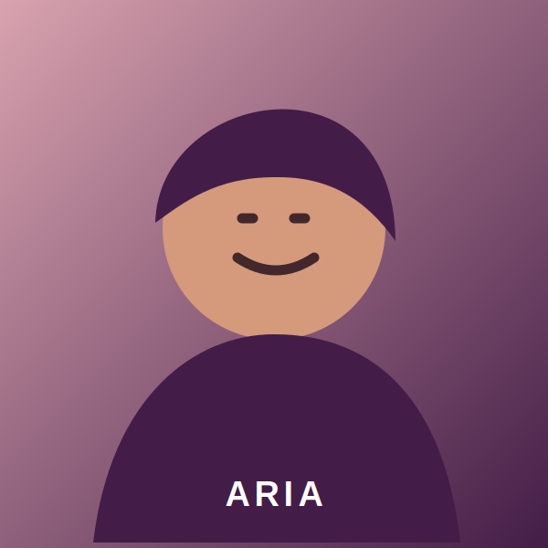
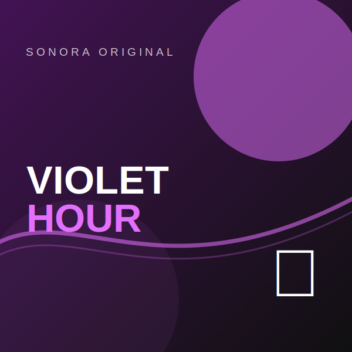

# 🎧 Sonora — Modern Music Streaming UI

> ⚠️ **Educational UI clone built for learning purposes only.**
> Sonora is an original fictional music streaming interface created to demonstrate frontend development skills. It is not affiliated with Spotify or any music streaming platform.

🔗 **Live Demo:** https://anushamamidiece-max.github.io/spotify-clone/  
💻 **Source Code:** https://github.com/anushamamidiece-max/spotify-clone

---

# 🗺️ Anatomy of the App

| Region | Description | Status |
|---------|-------------|--------|
| 🎵 Fixed Left Sidebar | Navigation menu, playlists & library | ✅ |
| 🎶 Main Content | Personalized recommendations, albums & artists | ✅ |
| ▶️ Sticky Music Player | Play/Pause, Next, Previous, Progress Bar, Volume | ✅ |
| 🌙 Dark / ☀️ Light Theme | Fully responsive theme switching | ✅ |
| 🔍 Search Page | Instant song & artist filtering | ✅ |
| ❤️ Liked Songs | Save favorite songs using Local Storage | ✅ |
| 📚 Library | Recently Played & Saved Collections | ✅ |
| 👤 Profile | User profile with playlists | ✅ |
| 📱 Responsive Design | Desktop, Tablet & Mobile | ✅ |

---

# 📸 Screenshots

### Landing Page


### Home


### Search


### Playlist


### Player


---

# 🔍 Biggest Challenge

The most challenging part was creating a **persistent sticky music player** while allowing only the main content area to scroll independently.

Other challenges included:

- Theme switching without page refresh
- Maintaining player state across pages
- LocalStorage for liked songs
- Smooth horizontal card sliders
- Responsive sidebar drawer
- Mobile music controls

---

# ✨ Features

- 🎵 Original Sonora branding
- 🌙 Dark & Light Theme
- ❤️ Like songs
- 🔎 Live Search
- 🎼 Playlist page
- 📚 Library page
- ⏮ Previous / Next
- ▶️ Play / Pause
- 🔁 Repeat
- 🔀 Shuffle
- 🔊 Volume Control
- 📈 Animated Progress Bar
- 📱 Fully Responsive
- 💾 LocalStorage support
- ⌨ Keyboard shortcuts
- 🎨 Smooth CSS animations

---

# 🛠 Tech Stack

- HTML5
- CSS3
- Vanilla JavaScript
- Local Storage API
- Git & GitHub
- GitHub Pages

### AI Tools Used

- ChatGPT
- GitHub Copilot

AI was used only for brainstorming, code explanation, debugging, documentation, and UI improvements. All implementation, customization, testing, and integration were completed manually.

---

# 📚 What I Learned

Building Sonora helped me improve my understanding of:

- Semantic HTML
- Modern CSS layouts
- Flexbox
- CSS Grid
- Responsive Web Design
- JavaScript DOM Manipulation
- Event Handling
- Local Storage
- Audio Controls
- Theme Management
- Page Navigation
- UI Animation
- Accessibility Best Practices
- Git & GitHub Workflow

---

# 📂 Project Structure

```
sonora/
│
├── index.html
├── home.html
├── playlist.html
├── search.html
├── library.html
├── liked.html
├── profile.html
├── settings.html
│
├── css/
├── js/
├── assets/
│
└── README.md
```

---

# 🚀 Getting Started

Clone the repository

```bash
git clone https://github.com/anushamamidiece-max/spotify-clone.git
```

Move into the project folder

```bash
cd sonora
```

Open

```
index.html
```

or run

```bash
python -m http.server 8080
```

Then visit

```
http://localhost:8080
```

---

# 🌟 Highlights

- Pixel-perfect streaming app UI
- Original branding
- Responsive across all devices
- Interactive music player
- Animated interface
- Smooth scrolling
- Modern UI/UX
- Clean code structure
- No frameworks
- Pure HTML, CSS & JavaScript

---

# 🎓 About TAP Academy

This project was built during my Frontend Development training at **TAP Academy**, Bangalore.

### Why TAP Academy?

- 🚀 Placement-focused training
- 💻 Real-time projects
- 🥽 AR-enabled learning
- 🎤 Weekly Mock Interviews
- 👨‍🏫 One-on-One Mentorship
- 📚 Java, Python, Full Stack, Data Science & AI

---

# ❓ FAQ

### What is Sonora?

Sonora is a fictional music streaming application developed to practice frontend technologies using HTML, CSS and JavaScript.

---

### Is Sonora connected to Spotify?

No.

Sonora is an independently designed educational project using original branding and placeholder assets.

---

### What technologies were used?

- HTML5
- CSS3
- JavaScript
- Local Storage
- GitHub Pages

---

### Is this project responsive?

Yes.

It supports desktop, tablet and mobile devices.

---

### Can I use this project?

Yes.

Feel free to fork, learn and customize it for educational purposes.

---

# 👩‍💻 Developer

**Mamidi Anusha**

Electronics & Communication Engineering (ECE)

Aspiring Full Stack Java Developer

GitHub: https://github.com/anushamamidiece-max

LinkedIn: https://www.linkedin.com/in/anusha-mamidi-9a4681302/

---

⭐ If you like this project, consider giving it a **Star**.